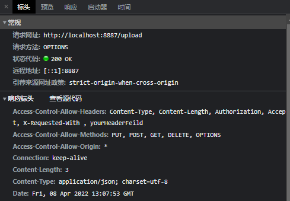
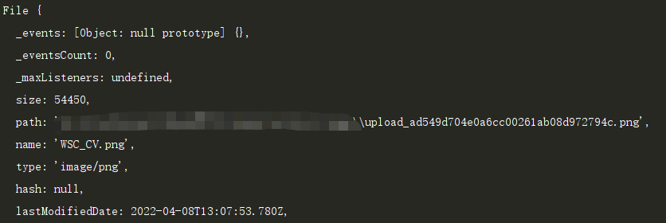
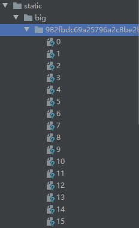

# # Node 实践

- **普通文件上传**
- **大文件分片上传**
- **断点续传**

**参考：**

- https://juejin.cn/post/6847902218977443854
- https://segmentfault.com/a/1190000040309502
- https://juejin.cn/post/6993318543315959816

## 涉及到的模块

- Koa
- koa-router
- koa-formidable 
- fs  处理文件模块，本功能下主要用到fs.rename 重命名文件并保存， fs.createReadStream、fs.createWriteStream读写流 fs.readdirSync(path) 读取文件夹下的所有文件。
- koa-static  设置静态文件服务器，使得可以访问到服务器上的静态资源
- http 开启http服务

### koa

```js
//中间件用法、洋葱模型(next)
app.use(async (ctx, next) => {
    ctx.body = {};
    next();
})
```

```js
// req
ctx.request.xx => ctx.xx
例：ctx.request.query => ctx.query; 获取请求的参数
// res
ctx.response.xx => ctx.xx
例：ctx.response.body => ctx.body; 设置响应体
```

## 1、普通文件上传

### CORS跨域

利用洋葱模型，在发送响应的预请求阶段设置CORS相关的响应头，平判断是否是 **OPTIONS请求**



```js
app.use (async (ctx, next) => {
    ctx.set('Access-Control-Allow-Origin', '*')
    ctx.set('Access-Control-Allow-Headers', 'Content-Type, Content-Length, Authorization, Accept, X-Requested-With , yourHeaderFeild');
    ctx.set('Access-Control-Allow-Methods', 'PUT, POST, GET, DELETE, OPTIONS');
    if (ctx.method === 'OPTIONS') {
        ctx.body = 200;
    } else {
        await next();
    }
})
```

### koa-formidable

此中间件主要是用于处理文件上传，使用后可以通过 ctx.request.files获取上传的文件对象（如下)，这里我们会用到path属性，将其修改为本地path(即可保存到服务器对应文件下)。



### 思路：

**浏览器端**

```html
借助form表单 和input file进行文件的传输。
<form>
        <div class="upload-file">
            
            <label for="file">请选择文件</label>
            <input type="file" name="file" id="big-file" accept="application/*">
     </div>
</form>
```

- 添加input标签的Change监听事件 在此事件中可进行中间操作判断文件大小等等

  ```js
  file.addEventListener('change', (e) => {
          let file = e.target.files[0];
          // console.log(file.slice(0, 100)); // Blob 对象 {size : 100, type: '' }
          if (file.type.indexOf('image') == -1) {
              return alert('文件格式只能是图片！');
          }
          if ((file.size / 1000) > 100) {
              return alert('文件不能大于100KB！');
          }
          links.href = '';
          file.value = '';
          this.upload(file);
      }, false);
  ```

- 借用 axios 库post请求，携带从input获取的file对象，构造FormData对象，post请求携带表单数据(formData)，并接受响应体数据(data)

  ```js
  async function upload (file) {
          let formData = new FormData();
          formData.append('file', file);
          let data = await axios({
              url: baseUrl+'/upload',
              method: 'post',
              data: formData,
              onUploadProgress: function(progressEvent) {
                  current.style.width = Math.round(progressEvent.loaded / progressEvent.total * 100) + '%';
              }
          });
          if (data.data.code == 200) {
              links.href = data.data.data.url;
              smallImg.src = data.data.data.url;
          } else {
              alert('上传失败！')
          }
      }
  ```

## 2、大文件上传(分片上传)

### 前端：文件分片、MD5加密、分片请求、合并请求

```js
//分片
function sliceFile(file) {
        const files = [];
        const chunkSize = 128*1024; //窗口Size
        for (let i = 0; i < file.size; i+=chunkSize) {
            const end  = i + chunkSize >= file.size ? file.size : i + chunkSize;
            let currentFile = file.slice(i, end);
            files.push(currentFile);
        }
        return files;
    }
// MD5 加密(spark-md5 这个库)
// 根据文件的二进制信息生成一个加密的key，即相同的文件生成同样的key
// 依赖fileReader把分配的文件数据读取为array buffer字节数组。通过监听fileReader的onload事件来获取到内容。
function md5File (files) {
        const spark = new SparkMD5.ArrayBuffer();
        let fileReader;
        for (var i = 0; i < files.length; i++) {
            fileReader = new FileReader();
            fileReader.readAsArrayBuffer(files[i]); 
        }
        return new Promise((resolve) => {
            fileReader.onload = function(e) {
                spark.append(e.target.result); //e.target.result里是ArrayBuffer字节流
                if (i === files.length) {
                    resolve(spark.end()); //当读取最后一片时，修改Promise状态为完成。
                }
            }
        })
    }

// 分片请求
// 请求携带参数分别为
// type: 上传(upload)操作还是合并(merge)操作，
// current: 上传的分片的索引 (1,2,3)
// md5Val: 文件的加密标识
// total: 分片的总数量
// ext: 文件类型后缀，方便服务端合并文件(pdf)
async function  uploadSlice(chunkIndex = 0) {
        let formData = new FormData();
        formData.append('file', fileArr[chunkIndex]);
        let data = await axios({
            url: `${baseUrl}/upLoadBig?type=upload&current=${chunkIndex}&md5Val=${md5Val}&total=${fileArr.length}`,
            method: 'post',
            data: formData,
        })
        if (data.data.code === 200) {
            if (chunkIndex < fileArr.length -1 ){
                bigCurrent.style.width = Math.round((chunkIndex+1) / fileArr.length * 100) + '%'; // 设置进度条
                ++chunkIndex;
                await uploadSlice(chunkIndex); //递归上传分片
        } else {
                mergeFile();
            }
        }
    }
// 合并文件请求
async function mergeFile () {
        let data = await axios.post(`${baseUrl}/uploadBig?type=merge&md5Val=${md5Val}&total=${fileArr.length}&ext=${ext}`);
        if (data.data.code === 200) {
            Promise.resolve().then(alert('上传成功！'))
            bigCurrent.style.width = '100%';
            bigLinks.href = data.data.data.url;
        } else {
            alert(data.data.data.info);
        }
    }
```

### 后端：保存分片文件、合并分片文件



**根据Post请求携带的type和current参数判断操作类型执行保存分片文件 和 合并操作**

```js
// 解析并获取请求参数，构造基友md5的文件夹用于存放文件片
const type = ctx.query.type;
const md5Val = ctx.query.md5Val;
// const total = ctx.query.total;
const current = ctx.query.current;
const ext = ctx.query.ext;

const filePath = path.join(dirPath + 'big', md5Val)
const isFileExist = await getStat(filePath)
if (!isFileExist) fs.mkdirSync(filePath);
```

**保存分片文件** — fs 进行rename操作（和文件上传同理)

```js
 const files = ctx.request.files.file
    const newPath = path.join(dirPath + 'big', md5Val , current)
    let renameFile = () => {
        return new Promise((resolve, reject) => {
            fs.rename(files.path, newPath, err => {
                resolve({
                    code: 200,
                    msg: 'get_succ',
                    data: {
                        info: 'upload success!'
                    }
                })
            })
        })
    }
    ctx.body = await renameFile();
```

**合并分片文件**

通过Stream流来读取数据，监听其中触发的事件如 **读取流** 的end事件，在end事件中判断是否所有文件片读取完成，如果是则改变异步的状态，否则继续读取下一个流。这里可写数据流只有一个，而可读数据流与分片的数量对应。

```js
// 主要是fs 读写流和管道的运用 
// readStream.pipe(writeStream);实现文件读写操作。
function mergeFile (filePath, newPath) {
    return new Promise((resolve, reject) =>
        {
            const  files = fs.readdirSync(filePath);
            const newFile = fs.createWriteStream(newPath)
            let filesArr = arrSort(files).reverse();
            main();
            function main (index = 0) {
                let currentFile = filePath + '/'+filesArr[index];
                let stream = fs.createReadStream(currentFile);
                stream.pipe(newFile, {end: false});
                stream.on('end', function () {
                    if (index < filesArr.length - 1) {
                        index++;
                        main(index);
                    } else {
                        resolve({code: 200});
                    }
                })
                stream.on('error', function (error) {
                    reject({code: 102, data:{error}})
                })
            }
        }
    )
}
```

## 3、断点续传

- 前端: 对分片上传进行改进，在每次切片上传之前，请求服务器接口，读取相同文件的已上传切片数。

  type为examine表示检查是否上传过文件片。

  根据返回的状态码判断是重传还是继续上传还是已上传过。根据服务端返回的切片数，上传新文件或上传剩余的切片数。

  ``` js
  async function uploadBig(file) {
          fileArr = sliceFile(file);
          md5Val = await md5File(fileArr);
          let data = await axios({
              url: `${baseUrl}/upLoadBig?type=examine&current=${null}&md5Val=${md5Val}&total=${fileArr.length}`,
              method: 'post',
              data: null,
          })
          if (data.data.code === 200) {
              if (data.data.done === true) {
                  alert("已上传完毕")
              } else {
                  await uploadSlice(data.data.chunkSize);
              }
      }
  ```

- 服务端：在examine类型下查找已存的分片文件。返回对应的分片状态

  ```js
  else if (type === 'examine') {
          const numberFile = fs.readdirSync(filePath).length;
          const resData = {
              code: 200
          }
          if (numberFile === Number(total)) {
              resData.done = true;
          } else {
              resData.done = false;
              resData.chunkSize = numberFile;
          }
          ctx.body = resData;
          return;
      }
  ```


# 探讨

## 分片大小的选择

-  分片越小，请求越多，开销越多
- 分片太大，导致部分文件未分片或分片太少，并没有很好的减少重传的开销。

**如何选择分片？**

- 分段的大小可以参照网速和稳定性以及服务器端，在局域网中传输10M左右的文件是很快的。一般选择1M，小于2M则不用分片。如果文件太大，建议分片的大小是5M，如果文件相对较小，那么建议分片的大小是2M。
- 根据文件大小，定义分片数量，自适应的确定分片大小。

**分片传输的优化**

- 可以采用批请求，比如10片一组。
- 并行传输。

## MD5加密算法的特征选择

**文件HASH**

通过计算HASH的方法可以唯一标识一个文件，基于文件数据流的，通过MD5可以得到此HASH。

**优化**

基于文件内容计算Hash是非常耗时的，并且会阻塞UI渲染线程。可以利用 **web-worker** 在worker线程中计算Hash。

```js
var myWorker = new Worker('worker.js'); //指定worker.js脚本作为执行worker线程的环境
```

## 秒传

- 判断文件Hash，如果文件已在服务端则直接显示上传成功。
