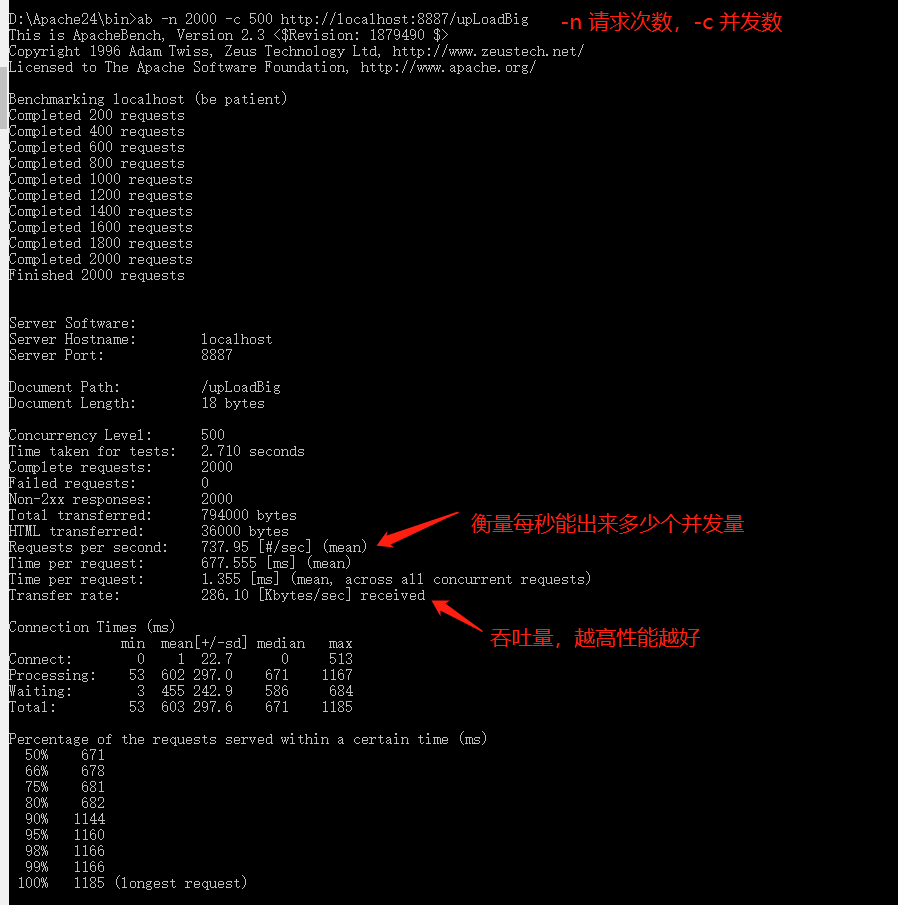

# Node 实践

- 登陆功能
- 权限管理

# 待完善。。。

# Node 性能调优

## apache ab

参考：https://blog.csdn.net/w405722907/article/details/86235418

ab命令会创建多个[并发](https://so.csdn.net/so/search?q=并发&spm=1001.2101.3001.7020)访问线程，模拟多个访问者同时对某一URL地址进行访问。它的测试目标是基于URL的，因此，它既可以用来测试apache的负载压力，也可以测试nginx、lighthttp、tomcat、IIS等其它Web服务器的压力。

