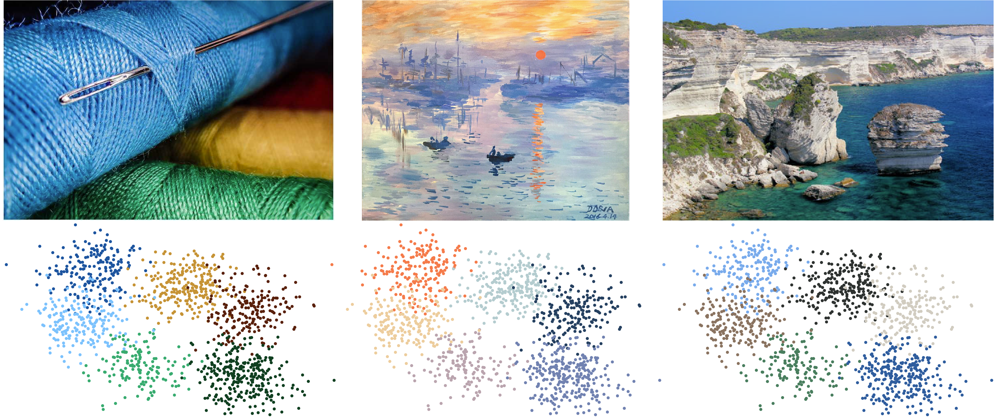
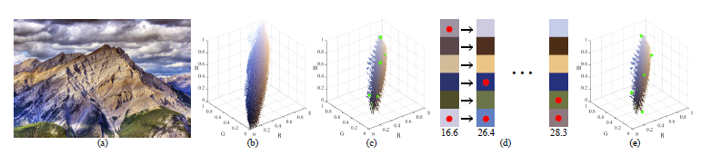
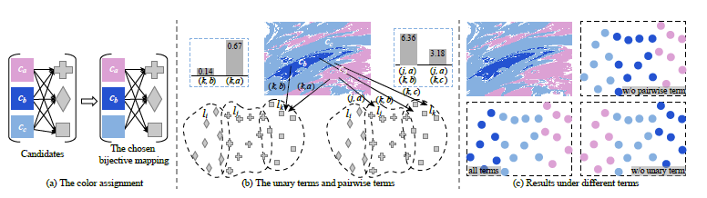
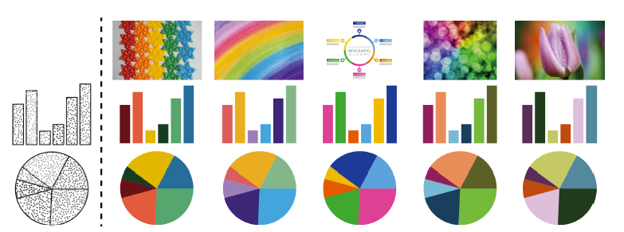
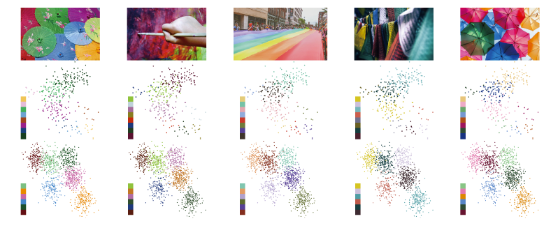
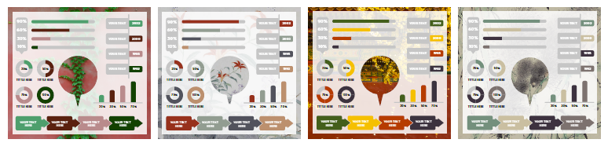

Image-guided color mapping for categorical data visualization （CVM 2021)

针对在类别数据可视化中存在的配色问题，提出了用图表来引导这类可视化的配色，可以帮助用户快速对类别可视化进行配色，能从样例图片上得到一个类区分度最大并且最美观的配色方案。

## 核心思想

**将图片映射到RGB三维空间中**，采用启发式的探索方法从图片中搜寻到相同类的数量的视觉差最大的颜色盘。

根据提取出来的颜色盘，在结合可视化中类的分布(散点图)，进行颜色赋值。

## **效果展示**

### 饼图和柱状图

###

### 散点图

### 信息图的配色

