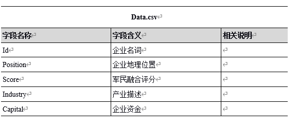
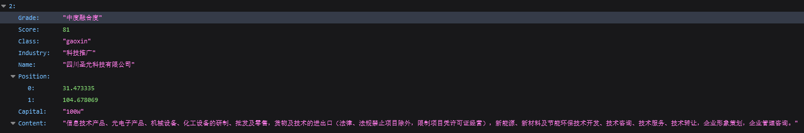
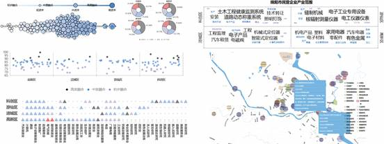
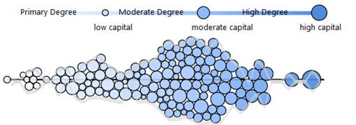
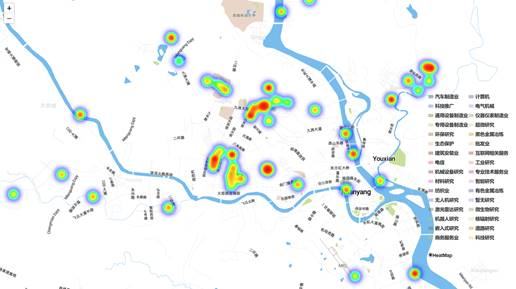
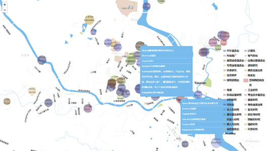
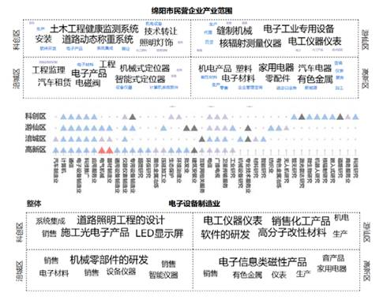

绵阳市军民融合可视分析系统 — **最佳海报提名奖** 中国可视化与可视分析大会(ChinaVis2019) 

## 项目简介 [github](https://github.com/wuuusicong/Vis_Military_civilian )

针对目前国内缺少成熟的基于军民融合数据的可视分析系统的问题,探究设计科技城绵阳市军民融合度的可视分析，为国内的军民融合分析提供借鉴，**探索绵阳市本地的军工产业和军民融合发展情况**。

## 数据介绍

## 可视化设计

本系统共有五个视图，包括气泡趋势图、扰动点图、卡片图、词云图和GIS地理信息图等多种视图，系统总体视图布局如图2所示。其中A展现企业在军民融合中的资金发展情况的气泡趋势图，B为对四个辖区内的企业的军民融合评价的扰动点图，C为四个辖区内的军民融合产业的卡片图，D与C进行联动，用词云图详细具体的呈现了C中产业的具体业务。

### 概览视图

#### 军民融合趋势气泡图

军民融合趋势气泡图用于展现企业资产与融合度的关系，通过将绵阳市企业编码成气泡，资产编码气泡的大小，颜色编码军民融合的程度可以发现，企业的资产与军民融合度呈**正态分布**。

显而易见，经济发展最好的公司伴随着最高的军民融合。 我们可以推测，也许军民融合对企业的发展有着良性的推动作用。

#### 地图中的多维比较

在此设计中，我们致力于通过使用热图来反映军民融合的总体分布情况，从而可以在下图中找到高，中，低军民融合的分布情况。我们选取了绵阳市主要对涪城、高新、科创、游仙等四个辖区内的企业军民融合情况进行了详细描述和对比。发现高新和科创区的军民融合情况较好，

除此之外，还有一个明显的现象，即高军民融合度集中在某个区域，而低军民融合度则是独立的。地图的另一种模型是比较具有相同行业的不同公司。例如，在下图中。 当我们代表一个行业将光标移到特定的图例上时，我们可以查看互联网服务公司的详细信息。

### 军工产业领域分析

**四辖区内产业融合分析**

如下图**多维词云图**所示，从上往下分析，词云图先展现了绵阳市总体的军工产业业务分布，从中可以看出，电子电器类、材料类、系统类是绵阳市军民融合产业的主要核心业务。从中间的打卡图，可以看出高新区中有两个高度军民融合产业，分别是电气机械和器材制造业。以电子设备制造业为例，通过鼠标点击打卡图中的电子设备制造业编码图形，词云图展现四个辖区内电子设备制造业的具体业务，其中科创区主要是电子产品的研发，涪城区是机械部件的研发，游仙区则是材料制造和化工产品的销售，高新区除了电子产品的研发外，还涵盖金属、家用电器生产等业务。

## 项目总结

该工作主要是帮助绵阳发展军民融合。 从总体来看，绵阳市的军工产业主要包括设备制造、卫星传输、激光雷达研究等等，除此之外，绵阳地区的高新区是军民融合发展最快的辖区，其主要产业涵盖了电子设备制造等，而且我们还发现了一个有趣的现象，即企业资金储备越雄厚，其产业越发达，往往军民融合程度越深，而且更有可能与军工企业合作。
